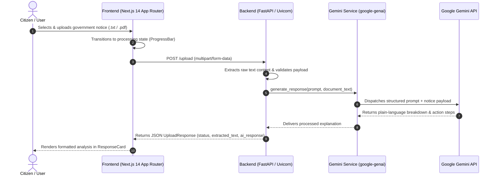

# CivicOps Architecture — Day 1 Foundation

CivicOps is an autonomous civic paperwork assistant designed to help citizens and businesses navigate complex government notices, citations, permits, and tax bills with clear, actionable guidance.

---

## 1. System Architecture & Data Flow (Day 1)

---

## 2. Layer Responsibilities

### Frontend Layer (`frontend/`)
- **Purpose**: Provides an intuitive, accessible interface featuring drag-and-drop file ingestion, real-time progress indicators, and structured card presentations for complex information.
- **Day 1 Scope**: Single-page flow connecting `UploadCard`, `ProgressBar`, and `ResponseCard` with sample case previews.

### API & Ingestion Layer (`backend/`)
- **Purpose**: Handles multi-part file ingestion, standardizes text extraction across document formats, enforces CORS policies, and exposes schema-validated REST endpoints (`/upload`, `/health`).
- **Day 1 Scope**: Synchronous text extraction for `.txt` and `.pdf` files, routing directly to `GeminiService`.

### AI & LLM Service Layer (`backend/services/gemini_service.py`)
- **Purpose**: Wraps Google Generative AI APIs (`gemini-2.0-flash`), encapsulating prompt engineering, temperature/token settings, and graceful error fallbacks.
- **Day 1 Scope**: Translates bureaucratic terminology into plain English summaries with explicit deadlines, dollar figures, and actionable checklists.

---

## 3. Roadmap for Day 2+ (Multi-Agent Architecture)

In upcoming milestones, the direct single-prompt Gemini flow will transition into an autonomous multi-agent system powered by Google ADK (Agent Development Kit):

1. **Document Agent (`document_agent.py`)**: Multi-modal document parser with OCR, layout understanding, and agency identification.
2. **Research Agent (`research_agent.py`)**: Real-time legal and regulatory search across municipal codes, statutes, and fee schedules.
3. **Workflow Agent (`workflow_agent.py`)**: Generates step-by-step resolution dependency graphs (deadlines, prerequisites, forms).
4. **Action Agent (`action_agent.py`)**: Drafts customized appeal letters, fills out standard PDF forms, and prepares submission packets.
5. **Monitoring Agent (`monitoring_agent.py`)**: Tracks filing status, alerts users before critical statutory deadlines, and confirms resolution.
